# gradient_descent

### Linear Regression
In statistics, linear regression is a linear approach to modelling the relationship between a dependent variable and one or more independent variables. Let X be the independent variable and Y be the dependent variable. We will define a linear relationship between these two variables as follows:

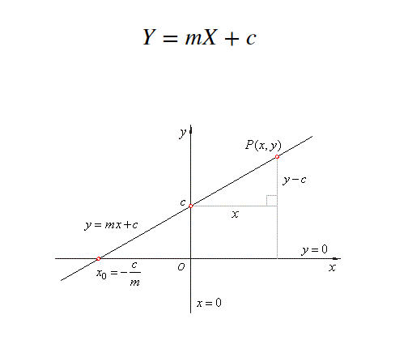

### Loss Function
The loss is the error in our predicted value of m and c. Our goal is to minimize this error to obtain the most accurate value of m and c. We will use the Mean Squared Error function to calculate the loss. There are three steps in this function:
1. Find the difference between the actual y and predicted y value(y = mx + c), for a given x.
2. Square this difference.
3. Find the mean of the squares for every value in X.

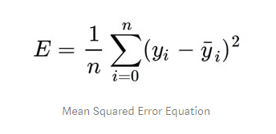

Here yᵢ is the actual value and ȳᵢ is the predicted value. Lets substitute the value of ȳᵢ:

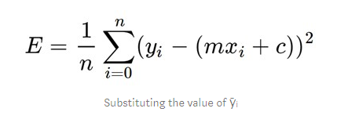

### Gradient Descent Algorithm
Gradient descent is an iterative optimization algorithm to find the minimum of a function. Here that function is our Loss Function.

Let’s try applying gradient descent to m and c and approach it step by step:
-  Initially let m = 0 and c = 0. Let L be our learning rate. This controls how much the value of m changes with each step. L could be a small value like 0.0001 for good accuracy.
- Calculate the partial derivative of the loss function with respect to m, and plug in the current values of x, y, m and c in it to obtain the derivative value D.

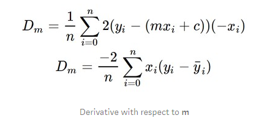

Dₘ is the value of the partial derivative with respect to m. Similarly lets find the partial derivative with respect to c, Dc :

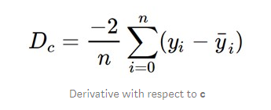

- Now we update the current value of m and c using the following equation:

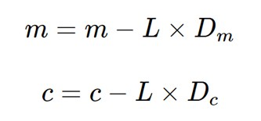

- We repeat this process until our loss function is a very small value or ideally 0 (which means 0 error or 100% accuracy). The value of m and c that we are left with now will be the optimum values.

### Calculations

##### Mean Squared Error:

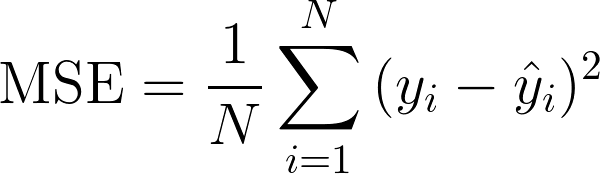

##### Root Mean Squared Error:

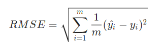

##### R2 Score:

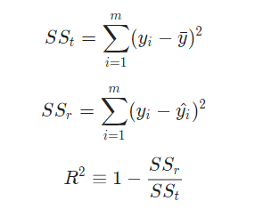

### Final Plot

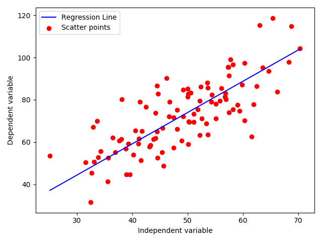

### Output

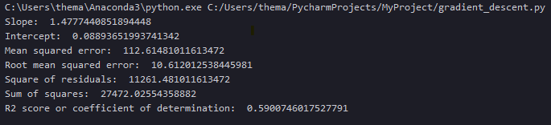
